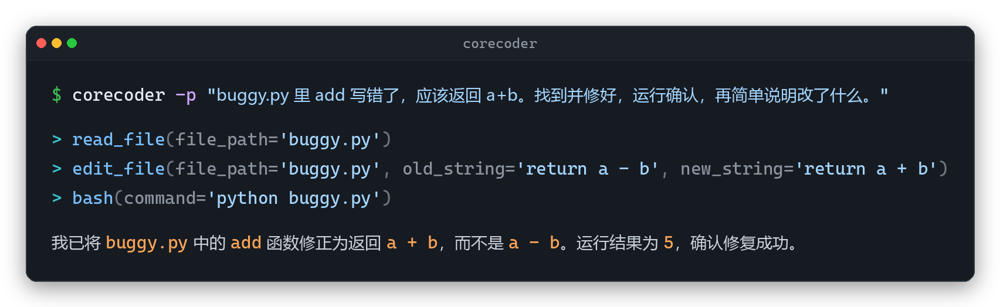

<div align="center">

# CoreCoder

**编程 agent 里的 nanoGPT。1081 行纯 Python，读懂一个 coding agent 到底怎么运作，再 fork 出你自己的。**

*learn from it · fork it · ship something better*


中文 | [English](README.md) | [配套源码导读 · 八篇双语](article/)

[](https://pypi.org/project/corecoder/)
[](https://python.org)
[](LICENSE)
[](https://github.com/he-yufeng/CoreCoder/actions)
[](article/)
[](article/)

</div>

本项目直接clone：https://github.com/he-yufeng/CoreCoder
此处建立仓库，用于日后改进和适配业务场景
目标：
    1. 整体架构使用langgraph
    2. 优化记忆存储
    3. 进行agent评估
    4. 业务落地：代码安全放心
    
- **读得完。** 一个下午读完整个引擎，没有一处藏着你看不懂的魔法。
- **改得动。** 每一行都能在你自己机器上下断点、改了再跑。它真能干活，所以这份参考是活的，不是示意图。
- **留白即起点。** 刻意只留最小核心，没做的那些不是半成品，是留给你 fork 出更好东西的地方。

## 和谁比

| | CoreCoder | Claude Code | aider | nanoGPT |
|---|---|---|---|---|
| 代码量 | 引擎约 1081 行 / 整包 1714 行 | 几十万行（闭源） | 数万行 Python | 约 600 行（两个文件） |
| 读完要多久 | 一个下午 | 读不了（闭源） | 得啃几天 | 一个下午 |
| 能不能下断点改了再跑 | 能，每一行 | 不能 | 能，但量大 | 能 |
| 定位 | 读懂并 fork 出你自己的 agent | 生产级编程助手 | 终端结对编程 | 教学用最小 GPT |

nanoGPT 那一列是拿来对照的：它最小、可读，但教的是训一个 GPT。CoreCoder 想干的是同一件事，只是把对象换成一个能真正改代码的 agent。和 Claude Code、aider 摆在一起，不是要跟它们抢用户，CoreCoder 是借它们来学、来起步的那块地基，根本不在一个赛道。

## 这是什么

我一直觉得 coding agent 被讲得太玄了。把 Claude Code、Cursor 这类工具扒到底，核心是一个 while 循环套着一个大模型，外加七八个让它能真正动手的工具。难的从来不是这个循环，而是循环跑进真实世界以后要兜的那些底。CoreCoder 就是把这个核心老老实实写出来的最小版本。

引擎部分（循环、模型接口、上下文、工具、会话）去掉空行和注释是 1081 行。连最外层的 CLI、配置、打包一起算，整个包 18 个文件、物理 1714 行、净 1385 行，每个文件都短到能一口气读完。

它真能跑：读写文件、执行 shell、派子 agent、分三层压上下文，还能随时把这趟烧掉的 token 和美元数报给你，86 个测试是绿的。但能跑不是为了劝你拿去日用，而是为了让这份「注释」不撒谎：一个解释 agent 怎么运作的范例，自己得真能运作。

代码来自一次公开拆解。公开的源码分析里，Claude Code 这类生产级 agent 暴露出不少关键架构，我挑出最核心的一层，用尽量少的代码诚实地复写了一遍。所以读 CoreCoder，约等于读一份基于公开源码分析的「可运行注释版」：讲的是这类 agent 的核心思路，而它本身只是最小复写，就摆在你机器上，随你拆、随你改。

<p align="center">
  
</p>

<p align="center"><sub><i>这一千行真能跑通一个完整回合：让它修 buggy.py，它自己读文件、改代码、跑一遍确认、再给结论。看完就回来读代码。</i></sub></p>

这份 README 也就按这条线铺开：上半带你**读懂**（代码地图、主循环、八篇导读），下半带你 **fork** 它、再指几个能往更好里做的方向。

## 先跑一次（读之前的五分钟）

读源码之前，先让它在你机器上活一次，建立点体感。它是个拿来 fork 的地基，所以推荐直接 clone 下来、可编辑安装，边读边改：

```bash
git clone https://github.com/he-yufeng/CoreCoder
cd CoreCoder
pip install -e .
```

只想先跑起来找找感觉，直接 `pip install corecoder` 也行。

给它一个模型加一把 key 就能动。默认走 OpenAI 兼容接口，换 provider 通常只是改两个环境变量：

| Provider | 环境变量示例 |
|---|---|
| OpenAI（默认 `gpt-5.5`） | `OPENAI_API_KEY=sk-...` |
| DeepSeek | `OPENAI_API_KEY=sk-... OPENAI_BASE_URL=https://api.deepseek.com CORECODER_MODEL=deepseek-chat` |
| 本地 Ollama | `OPENAI_API_KEY=ollama OPENAI_BASE_URL=http://localhost:11434/v1 CORECODER_MODEL=qwen2.5-coder` |

Kimi、Qwen 这些同样是改这两个变量；连 OpenAI 兼容接口都不给的 provider，装上可选的 LiteLLM 后端（`pip install "corecoder[litellm]"`）能路由一百多家。第三篇文章把这块讲得更细。key 可以直接 `export`，也可以在项目根目录扔个 `.env`，启动时自动加载。然后：

```bash
corecoder                                  # 交互式 REPL
corecoder -p "给 parse_config() 加错误处理"   # 一次性模式，干完就退
```

## 读懂它：代码地图

整个项目摊开就这么大，clone 之前扫一眼，心里就有数了。这也是它和 Claude Code 几十万行最实在的区别：你能把它当一本书的目录来读。建议从 `agent.py` 的主循环读起，那是整个 agent 的心脏。

```
corecoder/
├── agent.py        agent 主循环 + 并行工具执行       150 行   ← 从这里开始读
├── llm.py          流式客户端 + 重试 + 成本统计       336 行
├── context.py      三层上下文压缩                     210 行
├── session.py      会话存盘 / 续聊 + 路径穿越防护      97 行
├── prompt.py       系统提示词                          33 行
├── cli.py          REPL + 斜杠命令 + 一次性模式        270 行
├── config.py       环境变量配置                        57 行
└── tools/
    ├── bash.py       shell + 危险命令闸 + cd 追踪      127 行
    ├── edit.py       唯一匹配搜索替换 + diff            92 行
    ├── grep.py       内容搜索                           79 行
    ├── glob_tool.py  文件名匹配                         47 行
    ├── read.py       文件读取                           53 行
    ├── write.py      文件写入                           38 行
    ├── agent.py      子 agent 派生                      58 行
    └── base.py       工具基类                           27 行
```

七个工具：`bash`、`read_file`、`write_file`、`edit_file`、`glob`、`grep`、`agent`（派子 agent）。其余都是包在引擎核心外面的 CLI 外壳、配置和打包。

## 一个 while 循环就是 agent 的本体

一个 agent 的本体，一句话就能讲清：把用户的话交给模型，模型想调工具就执行，把结果塞回上下文，再问模型，直到它不再要工具、给出回答。落到代码，也就十来行：

```python
# corecoder/agent.py · 主循环（精简骨架）
def chat(self, user_input):
    self.messages.append(user_input)

    for _ in range(self.max_rounds):                   # 循环有上限，跑不飞
        reply = self.llm.chat(self.messages, self.tools)   # 交给模型规划下一步
        if not reply.tool_calls:                       # 模型不再要工具
            return reply.text                          #   → 收工，把回答给用户
        results = run_parallel(reply.tool_calls)       # 要工具就并发执行
        self.messages += results                       # 结果回灌，进入下一轮

    return "(已达轮次上限)"
```

就这么点。这个循环的核心骨架就二十来行，把并行执行和被 Ctrl+C 打断后的回填都算上，也才四十多行。CoreCoder 一千多行里剩下的，几乎全在收拾它真跑起来之后冒出来的岔子。`llm.py` 最后成了全项目最大的文件，不是因为调模型有多难，而是流式返回里一个工具调用的参数会被切成好几段先后送到、得按顺序拼回去，provider 偶尔吐半截 JSON 或把 usage 填成 null，限流（429）、超时、连接中断和 5xx 都得退避重试，其余 4xx 该直接抛就别硬试。这些不起眼的脏活，而不是那个循环，才是一个 agent 从能演示走到能交付真正吃工程功夫的地方；第三篇文章顺着它拆到每一行。

有三个决定值得单独看，因为它们是「先读懂别人怎么做」之后才做得出的取舍，也是你 fork 自己 agent 时可以直接抄走的判断。

**`edit_file` 用唯一匹配的搜索替换，不靠行号。** 行号这东西，模型只要数偏一行，就会悄悄改错地方；锚定一段唯一的原文：匹配不到，就把文件开头甩回去让模型照着重新锚定；匹配到多处，就让它多带几行上下文再来，而不是赌一个。改成功了，连一段 diff 一起返回。失败能复位、成功能复核，闭环都收在工具自己手里。

**上下文不是满了才一刀切，而是按代价从轻到重分三档退让。** 先在半满（50%）时把超长的工具输出就地截短，这一档纯机械、不花一次模型调用；到 70% 还压不下去，就把较早的轮次交给模型总结成一段摘要，最近几轮原文原样留着；逼到 90% 才进应急档，连摘要带最近几轮一起收到最紧。粗暴截断往往恰好丢掉一个长任务最依赖的早期决定；分层退让，是让它按重要性从低到高一档档地让，而不是一上来就把最老的决定整段切掉。

**约束子 agent 能干什么，靠的是不给它那把工具，而不是写一堆规则求它听话。** 派出去的子 agent 拿到的是隔离的上下文、自己独立的一份历史，工具集只比父 agent 少一样：`agent` 工具本身，于是它没法再往下递归派子 agent。少给一件工具，比事后立一条规矩干净得多。它还复用父 agent 同一个模型连接（花销一并算进总账），输出一过 5000 字就截短、只留开头一段，轮次上限也压得比父 agent 更短。同一套克制，从头贯到尾。

每一个「为什么」，下面的文章系列都拆到了具体代码行。

## 配套源码导读 · 八篇双语

我还写了一套双语源码导读，一篇导言加七篇正文，每篇都配英文镜像（`_EN.md`）。它对着 CoreCoder 的真实代码，讲 Claude Code 这类 agent 的内部构造。有一条给自己立的硬规矩：每一处行数、每一段代码都从仓库里现读现核，绝不凭印象编。前六篇带你读懂，第七篇带你 fork，哪篇先读都行。

- **[导言 · 用 CoreCoder 读懂 Claude Code，再造一个你自己的](article/00-index.md)**
- **[01 一个 agent 的本体，是一个 while 循环](article/01-the-loop.md)** — `agent.py` 的主循环、打断与轮次上限
- **[02 工具系统：让模型安全地动手](article/02-tools.md)** — `tools/` 七个工具与 bash 安全闸
- **[03 接入任意大模型，顺便把账算清楚](article/03-llm-and-cost.md)** — `llm.py` 的 provider 包装、重试与成本统计
- **[04 用有限的窗口扛住一个长任务](article/04-context.md)** — `context.py` 的三层压缩与孤儿 tool 消息
- **[05 并行执行与子 agent](article/05-parallel-and-subagents.md)** — 线程池并发与子 agent 隔离
- **[06 把它跑成一个真正的命令行工具](article/06-session-and-cli.md)** — `session.py` 与路径穿越防护
- **[07 Fork CoreCoder，搭一个你自己的 coding agent](article/07-build-your-own.md)** — 从 fork 到加自定义工具到换模型

## Fork 它，造个更好的

读懂之后，最自然的下一步就是 fork。起手不用伤筋动骨：

- **换个你常用的模型。** 就是上面那两个环境变量，`llm.py`（336 行）是所有 provider 适配的入口。
- **加一件你自己的工具。** 照 `tools/base.py`（27 行）的工具基类写个新文件，跑测试、抓网页、调 LSP 都行，第二篇文章末尾手把手带你写第一个。
- **改系统提示词。** `prompt.py` 才 33 行，改一句就能看到 agent 的脾气变了，是门槛最低的「改一处就有反馈」。
- **直接当库 import。** 顶层导出了 `Agent`、`LLM`、`Config`，能嵌进你自己的程序：

```python
from corecoder import Agent, LLM

llm = LLM(model="deepseek-chat", api_key="sk-...", base_url="https://api.deepseek.com")
print(Agent(llm=llm).chat("找出项目里所有 TODO 注释并列出来"))
```

往深里做，方向也都摆在明处。下面这些 CoreCoder 都没做，是设计取舍，不是没做完；换个角度，每一条都是你能接着往下做、把它推向更强的入口：

- **bash 的危险命令拦截只是正则黑名单。** 防手滑，不是安全沙箱。要面对不可信输入，就得上 seccomp 或容器隔离。这条最硬，要一路走到系统调用和隔离那一层。
- **重试只做了指数退避。** 没有 fallback 模型，也没有美元硬预算。顺着 `llm.py` 往下，加一条 fallback 模型链和超预算自动停的闸，改动基本就集中在这一个文件。
- **子 agent 只有最朴素的同步执行。** 做成异步或流式执行器，正好补上第五篇点名的、相对生产级 agent 流式执行的那段差距。
- **不做 MCP，不做 RAG。** 接上 MCP 让它用上外部工具生态，或给大仓加检索式的代码定位，都是从「最小核心」往「你自己的更强 agent」扩的真实方向。

README 只给方向，每条的代码细节第七篇接着讲。挑一个动手，就是把它做得更好的开始。

## 命令

进了 REPL，`/help` 列全部，常用的这几个：

```
/model <名称>    切换模型
/compact         手动压缩上下文
/tokens          查看 token 用量和费用估算
/diff            查看本次会话改过的文件
/save  /sessions 保存 / 列出会话
quit / exit      退出（Ctrl+C 取消当前回合）
```

会话 ID 会先清洗成安全字符再拿去当文件名，存档统统落在 `~/.corecoder/sessions` 里，恶意会话名穿越不出去。

## 相关项目

如果你读 CoreCoder 读得还顺，下面几个我做的 agent / LLM 系统方向的工具也许用得上：

- **[RepoWiki](https://github.com/he-yufeng/RepoWiki)** — 被丢进一个陌生代码库？它给你一份带「从哪读起」路径的 wiki，一个可自托管的 DeepWiki 替代。
- **[FindJobs-Agent](https://github.com/he-yufeng/FindJobs-Agent)** — 别再手动刷招聘网站：它按你的简历给岗位排序，还能跑模拟面试。
- **[ContractGuard](https://github.com/he-yufeng/ContractGuard)** — 签字前先把有风险的条款挑出来：它读合同、标出危险点。
- **[GitSense](https://github.com/he-yufeng/GitSense)** — 想给开源做贡献？它帮你找到值得做的 issue，还能估你的 PR 多大概率被合。
- **[CodeABC](https://github.com/he-yufeng/CodeABC)** — 不会写代码也能看懂一个项目，专给小白做的。

## 贡献 / License

动手之前先跑一遍 `pytest tests/ -q`（86 个测试）、`ruff check` 和 `compileall`，绿了再提。MIT License，欢迎 fork 拿去造更好的东西，能在 README 里留一句出处就更好。

---

作者 [何宇峰](https://github.com/he-yufeng)，曾任职 Moonshot AI (Kimi)。早前写过一篇相当完整的 [Claude Code 源码分析](https://zhuanlan.zhihu.com/p/1898797658343862272)，这个项目是它的动手版：那篇带你读懂，这个带你重建。

> CoreCoder 原名 NanoCoder，为避免和 [Nano-Collective/nanocoder](https://github.com/Nano-Collective/nanocoder) 混淆而改名，旧链接会自动跳到这里。
